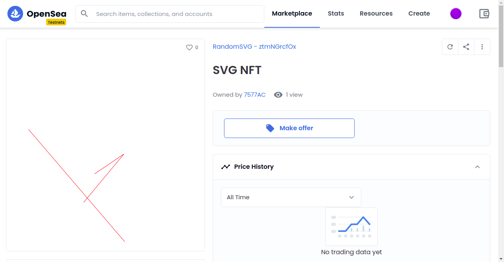

# NFT-721 Eth Standard
Smart contract project built in the Rinkeby Test Network for Ethereum. The contract consist on building an NFT token contract with the ERC-721 implementation for building non-fungible tokens on the ethereum virtual machine that creates a random svg image getting the randomness through Chainlink VRF VRFConsumerBase contract.



## Built With
- Solidity 0.8.0
- JavaScript
- hardhat
- Rinkeby Test Network
- Chainlink
- Metamask Wallet
- Alchemy

## Author

- 👤GitHub: [Jose Abel Ramirez](https://github.com/jose-Abel)
- Linkedin: [Jose Abel Ramirez Frontany](https://www.linkedin.com/in/jose-abel-ramirez-frontany-7674a842/)

## Getting Started

To download the project either can do it with with git clone command:

```
    git clone https://github.com/jose-Abel/RandomSVG-NFT.git
```

Install the yarn and npm packages with:

```
    yarn install
```

Install the hardhat shorthand syntax

```
    npm i -g hardhat-shorthand
```

Create a free account at https://www.alchemy.com/


Create a new project at https://dashboard.alchemyapi.io/ and copy the API Key for the new project.


Create a .env file in the root of the project and save the following environment variables:

```
    RINKEBY_RPC_URL=<Your Alchemy API Key>

    MNEMONIC=<Your Metamask Wallet Mnemonic>

    ETHERSCAN_API_KEY=<Your Etherscan API Key>
```

The project has 3 deploys scripts, 00_deploy_mocs.js and 01_deploy_svgnft.js were to deploy locally for testing purposes.

To deploy the RandomSVG contract, Create and NFT from it and Finish the minting of the NFT by generating a random SVG, on the rinkeby network, run the 02_deploy_randomSVG.js script with the following command:

```
    hh deploy --network rinkeby --tags rsvg
```

To deploy to polygon main network

```
    hh deploy --network polygon --tags rsvg
```


## Live version

- Smart Contract on the rinkeby network

https://rinkeby.etherscan.io/address/0x6b92cad76e5ec0d3b43e5b287248b6cd98a00cd5

- NFT on OpenSea

https://testnets.opensea.io/assets/0x6b92cad76e5ec0d3b43e5b287248b6cd98a00cd5/0

https://testnets.opensea.io/assets/0x6b92cad76e5ec0d3b43e5b287248b6cd98a00cd5/1


## 📝 License

This project is MIT licensed.

## Show your support

Give a ⭐️ if you like this project!
